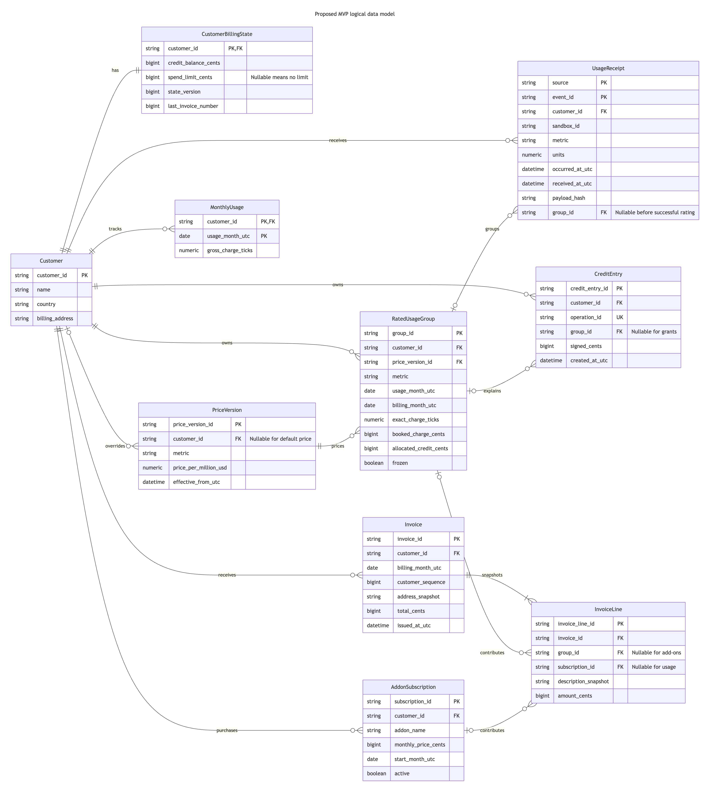
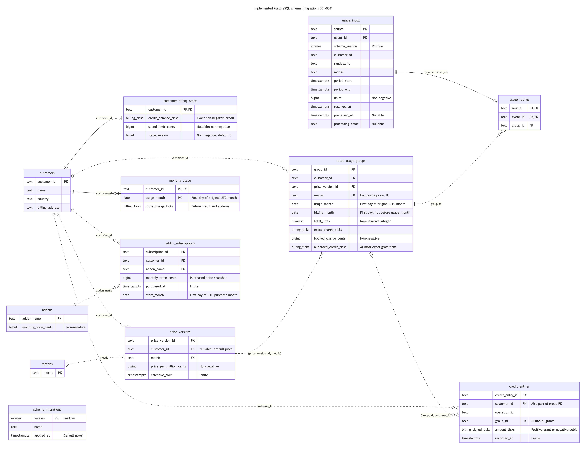

# Billing model and assignment seed data

## Summary

This document explains the billing data model, the reasons behind its architecture,
and how PostgreSQL stores and verifies the assignment's financial state:

- [Logical data model (ERD)](#logical-data-model-erd): billing concepts, their relationships, and an editable diagram.
- [Architectural decisions and rationale](#architectural-decisions-and-rationale): database choice, customer locks, durable ingestion, retry identities, exact accounting, audit history, immutable invoices, and separation of responsibilities.
- [Implemented PostgreSQL schema](#implemented-postgresql-schema-erd-migrations-001009): the complete schema through migration 009, SQL columns, keys, and cardinalities.
- [Tables and relationships](#tables-and-relationships): table purposes, foreign keys, ownership checks, mutable projections, and append-only history.
- [Money and months](#money-and-months): ticks and cents, the charge formula, arbitrary precision, UTC periods, and historical price selection.
- [Initial data and migrations](#initial-data-and-migrations): startup commands, assignment catalog values, initial account state, exact-credit conversion, and transactional migration behavior.
- [Transactional processing and verification](#transactional-processing-and-verification): time-zone checks, isolated fixtures, atomic worker updates, processed-usage closing, and public API simulator coverage.

The schema stores the assignment catalog, transactional accounting, financial command identities, processed-usage closing, and immutable monthly invoices. [Shared financial rules and pure Go calculations](accounting-rules.md) define rating, exact credit, rounding, and UTC routing; the worker and public APIs implement those rules in `internal/billing`.

Read the logical model first, then the architectural decisions and their trade-offs, followed by the PostgreSQL schema, financial representation, migrations, and transaction details. The [usage-to-invoice guide](usage-to-invoice.md) follows the accounting pipeline and explains the fields used at every stage.

## Logical data model (ERD)

The logical model introduces customers, metered usage, historical prices, credit, add-on purchases, and monthly invoices before considering SQL tables and constraints. The diagram shows the main billing concepts and their relationships; the implementation sections below describe their PostgreSQL representation. Invoice lines and immutable monthly invoices are explained in the [usage-to-invoice guide](usage-to-invoice.md#8-invoiceline-what-appears-on-a-particular-invoice).



[Editable Mermaid source](../diagrams/data-model/data-model.mmd).

Conceptually, accepted usage is rated using historical prices, consumes available usage credit, and contributes to a monthly invoice alongside purchased add-ons. The architectural decisions below explain how these responsibilities map to durable input, financial state, and immutable output.

## Architectural decisions and rationale

These decisions describe the current implementation. Assignment requirements and implementation assumptions are distinguished in [the financial rules](accounting-rules.md); the trade-offs below do not imply measured production capacity.

- **Use PostgreSQL for durable input and accounting.** Exact integer-valued `numeric`, row-level locks, and a partial index containing only pending inbox rows fit this billing model. Unlike [SQLite's single concurrent writer](https://www.sqlite.org/lang_transaction.html), PostgreSQL permits concurrent writes to different customer rows; its [unconstrained `numeric`](https://www.postgresql.org/docs/18/datatype-numeric.html#DATATYPE-NUMERIC-DECIMAL) also has a wider precision range than [MySQL `DECIMAL`](https://dev.mysql.com/doc/refman/8.4/en/precision-math-decimal-characteristics.html). Ingestion and accounting share database resources.

- **Separate customer identity from billing state.** `customers` holds profile data; `customer_billing_state` holds the mutable financial account. Financial writers select the account by `customer_id` with `FOR UPDATE`, leaving ordinary profile updates independent of that row lock. At [READ COMMITTED](https://www.postgresql.org/docs/18/transaction-iso.html#XACT-READ-COMMITTED), a waiting writer rechecks `WHERE` against the committed row and reads the updated balance when the customer still matches. `state_version` is incremented with financial effects as a revision counter; it is not a lock filter. Separate tables require occasional joins and account creation alongside the customer: the PK/FK guarantees at most one account, not that every customer has one.

- **Serialize financial changes per customer.** Usage accounting and credit allocation, credit grants, spend-limit changes, add-on purchases, and invoice closing acquire the account lock before reading mutable financial state, then commit their related changes together. The account row coordinates changes across the ledger, usage projections, subscriptions and invoices; for example, a new subscription cannot race with freezing the same billing month. Closing holds the lock throughout its single publication transaction. This shared protocol limits parallel financial writes for one busy customer.

- **Persist usage before asynchronous accounting.** Ingestion acknowledges a durable receipt without waiting for rating and credit allocation. The inbox has no customer or metric foreign keys, so unknown catalog identifiers remain available for diagnosis rather than losing the submitted event. The trade-off is delayed financial visibility: acceptance does not mean successful accounting. Temporary database failures roll back and retry automatically; unsupported input is retained with `processing_error` and excluded from automatic processing. After diagnosing and correcting the cause, an operator must explicitly release the affected receipt for another attempt, as described in the [recovery instructions](../guides/accounting-recovery.md#investigate-and-release-a-receipt).

- **Use stable identities and content checks for retries.** `(source, event_id)` identifies usage; financial commands have operation identities. Identical retries preserve the previous effect, while changed input under the same identity conflicts. After acquiring the account lock, the worker reselects the receipt with `processed_at IS NULL AND processing_error IS NULL`: completion or quarantine by another committed worker makes a stale candidate fail this filter and be skipped. The worker commits the rating link, financial projections, ledger changes, and receipt completion together, so a failed attempt cannot leave a partial charge. Unique constraints support this protocol but do not replace content comparison or the transaction.

- **Keep exact ticks and round cumulative groups.** Integer ticks preserve sub-cent usage and credit; Go arbitrary-precision integers and PostgreSQL integer-valued `numeric` avoid floating-point error and intermediate `bigint` overflow. Grouping by customer, price version, usage month, and billing month prevents individual event or sandbox boundaries from introducing extra rounding. The cost is more explicit money conversion and group-level invoice presentation; intervals crossing supported month or price boundaries must currently be rejected.

- **Append historical prices and snapshot purchased add-on prices.** Consumption uses the applicable historical price and customer override, while a subscription retains its purchased price. Later catalog changes therefore cannot silently reprice earlier usage or an existing purchase. Price history and ownership checks add storage and validation work; retroactive corrections need a separate policy.

- **Keep audit history beside mutable projections.** `credit_entries` and `usage_ratings` preserve how balances and groups changed; account balances and `monthly_usage` make current-credit and monthly-limit reads direct. A separate original-month gross projection is necessary because limits exclude credit and add-ons, even when late usage is invoiced later. These duplicated totals must be maintained in the same transaction; constraints alone do not reconcile them with history.

- **Separate the UTC usage month from the billing month.** Late consumption keeps its original price and spend-limit month but moves to an open billing month after closure. This preserves issued invoices without losing the consumption's origin. Explicit UTC calculation avoids dependence on session time zones, at the cost of carrying both month identities through groups and invoice lines.

- **Publish invoices from processed groups.** One customer-account-locked transaction snapshots groups already accounted by the worker, freezes them, closes the month and advances numbering. Pending and quarantined usage do not delay issuance; later processing routes to an eligible open month. This accepts an incomplete current invoice for simpler closing independent of backlog size. Buyer and financial snapshots remain immutable.

- **Separate pure calculations from persistence and transport.** `internal/accounting` calculates prices, credit, months, and invoice amounts without I/O; `internal/billing` owns locks and financial transactions, while HTTP code owns request and response handling. This makes financial rules directly testable and keeps transaction boundaries visible. Database constraints still protect structural integrity, so changes to a rule must keep calculations, persistence, and validation consistent.

## Implemented PostgreSQL schema (ERD, migrations 001–009)

`UsageReceipt` maps to `usage_inbox` plus the separate `usage_ratings` link. Invoices use immutable JSON snapshots and frozen-group links rather than the separate line table proposed in the logical ERD.

This diagram shows all 16 tables and their SQL columns, primary keys, foreign keys, and relationship cardinalities after migrations `001` through `009`, including the runner's `schema_migrations` table. It uses the names and types from the migrations and includes closure, command history, invoice snapshots, and frozen-group links.



[Open full-size PNG](../diagrams/implemented-data-model/implemented-data-model.png) · [Editable Mermaid source](../diagrams/implemented-data-model/implemented-data-model.mmd).

All columns are `NOT NULL` unless labeled nullable. `PK` and `FK` mark columns belonging to primary and foreign keys, including composite keys. Solid relationships include the referenced identity in the child's primary key; dashed relationships are other declared foreign keys. The Mermaid source records the composite unique constraints. `billing_ticks` is an exact `numeric` domain for non-negative finite integers; one cent is 1_000_000 ticks.

`usage_inbox` has no customer or metric foreign keys. Its optional one-to-one relationship with `usage_ratings` records whether an event has been assigned to a group; each rating references one `rated_usage_groups` row. The diagram shows database cardinalities, so a customer may have zero or one account-state row even though the seed creates one for each initial customer. Receipt matching and price ownership checks are enforced by triggers, as described below.

`invoices` references a closed customer/month; `invoiced_usage_groups` links each group to at most one invoice and activates the group-freeze trigger. Buyer details, issue time and lines live in the immutable JSON snapshot. Migration 009 retires the three pending-usage closing tables; the worker and closing coordinate through the existing account lock and committed closed months.

## Tables and relationships

| Table | Purpose and relationships |
| --- | --- |
| `customers` | Customer identity, name, country, and current billing address. |
| `customer_billing_state` | One account row per customer with exact credit balance, optional spend limit, state version, and next invoice number. Financial writers serialize on this row. |
| `metrics` | Supported metering identifiers. |
| `price_versions` | Historical prices for a metric, either a default (`customer_id IS NULL`) or a customer override. Each version has an explicit effective timestamp. |
| `rated_usage_groups` | Totals grouped by customer, price version, original usage month, and billing month; stores exact units/gross ticks, booked gross cents, and allocated credit ticks. |
| `usage_ratings` | Links one `(source, event_id)` from `usage_inbox` to exactly one group. Many events can share a group. |
| `monthly_usage` | Gross usage charges in exact ticks per customer and original UTC month, before credit and add-ons. |
| `credit_entries` | Exact signed tick history: positive grants without a group and negative usage debits referencing a group owned by the same customer. `(customer_id, operation_id)` prevents duplicate operations. |
| `addons` | Add-on catalog and monthly price in cents. |
| `addon_subscriptions` | Customer purchases with a monthly price snapshot and the UTC purchase month. One subscription per customer and add-on is supported; cancellation and multiple quantities are future work. |
| `closed_billing_months` | Immutable customer/month closures used to route late consumption forward. |
| `spend_limit_operations` | Immutable operation results; replaying an old identity cannot undo a newer limit. |
| `invoices` | One immutable snapshot per customer/month, with unique per-customer number and total cents. Buyer details, ordered lines, exact audit ticks, and issue time are in `snapshot`. |
| `invoiced_usage_groups` | Links issued invoices to groups; a trigger rejects changes to frozen groups. |

Identifiers, balances, prices, and timestamps are supplied explicitly. `customer_billing_state.state_version` defaults to zero and `next_invoice_number` to one for new accounts; callers may supply explicit initial values. Version increments and text validation remain application responsibilities. The inbox remains independent of the catalog: ingestion can preserve unknown customers or metrics for an explicit processing error rather than losing the input.

Foreign keys reject missing catalog records, missing receipts, and credit debits for another customer's group. A group's price must belong to its metric and be either a default or an override for that customer. Group identity cannot change after insertion; totals can increase as the worker processes more events. Rating links require the same customer and metric and an interval wholly within the original UTC month, including intervals ending exactly at the next month's boundary.

Prices, credit entries and rating links reject row updates and deletes. Price changes append a new version; they do not rewrite past prices. Customer details, account projections, group totals, monthly totals, and the add-on catalog remain mutable. A subscription retains its purchased price when the catalog changes.

## Money and months

All amounts are USD. Credit balances, allocations, and ledger entries use exact integer ticks. Limits, add-on prices, and the booked gross projection use integer cents. The initial price contract supports whole cents per million units: `price_per_million_cents` is `5`, `6`, or `4` for the assignment prices of USD 0.05, 0.06, and 0.04 per million.

One tick is one millionth of a cent, or USD 0.000_000_01. For this price contract:

```text
price_unit_count = 1_000_000
ticks_per_cent = 1_000_000
exact_charge_ticks = (((units × price_per_million_cents) × ticks_per_cent) / price_unit_count)
```

`accounting.PriceUnitCount` defines the resource units covered by the price; `accounting.TicksPerCent` defines monetary resolution. They currently have equal values and cancel in the formula. [Issue #29](https://github.com/pupitooo/e2b-billing-api/issues/29) proposes storing `price_unit_count` on each historical price version, backfilling existing versions with 1_000_000, and requiring new rates to be exactly representable in whole ticks. That proposal preserves the current tick scale; this implementation still uses a fixed price denominator.

Integer-valued PostgreSQL `numeric` stores exact tick totals and aggregate units beyond the `bigint` range. Negative, fractional, infinite, and NaN values are rejected. The Go rater uses immutable arbitrary-precision integers and checks conversions to signed 64-bit cents. PostgreSQL documents the distinction between [exact numeric and floating-point types](https://www.postgresql.org/docs/18/datatype-numeric.html).

Cyberdyne's first rate is USD 0.05 (5 cents) per 1_000_000 units. Its first 123_456_789 units are charged as follows:

```text
exact_charge_ticks = (((123_456_789 × 5) × 1_000_000) / 1_000_000)
                   = (123_456_789 × 5)
                   = 617_283_945 ticks
ticks_per_dollar = (100 × 1_000_000) = 100_000_000
exact_charge_usd = (617_283_945 / 100_000_000) = USD 6.172_839_45
booked_gross_cents = floor(((617_283_945 + 500_000) / 1_000_000))
                   = 617 cents = USD 6.17
```

First multiply units by the price in cents, then multiply by ticks per cent, and finally divide by the units covered by that price. The two million-valued constants cancel, so this rate charges 5 ticks per resource unit. The group stores the exact tick amount alongside its booked 617 gross cents; subsequent usage is added to the exact group total before rounding again.

Credit is allocated against new exact ticks before rounding. The shared Go helpers round cumulative gross and net groups and derive a balancing credit line; migrations do not perform accounting. `allocated_credit_ticks` cannot exceed `exact_charge_ticks`, even when rounded gross cents are higher.

`usage_month` and `billing_month` are finite first-of-month `date` values. Application code derives them in UTC. Late October usage billed in November retains `usage_month = 2026-10-01` and `billing_month = 2026-11-01`; its gross spend belongs to October. Billing months cannot precede usage months. Timestamps are finite `timestamptz` values. Subscription start months are checked against the purchase timestamp in UTC, independently of the SQL session's time zone.

**The fixed billing contract is one immutable invoice per customer for a whole
UTC calendar month.** A chosen generation or delivery day cannot change the
period into a cycle starting on that day. `(customer_id, billing_month)` identifies
both the final closure and invoice; `closed_at` records the actual closure time,
not the end of a custom usage interval. See the [fixed calendar-month contract](accounting-rules.md#fixed-calendar-month-contract)
and the [generation and delivery proposals, including the completed-month requirement](accounting-rules.md#invoice-generation-and-delivery-proposal).

Default and customer prices can coexist at the same instant. `UNIQUE NULLS NOT DISTINCT (customer_id, metric, effective_from)` prevents two default prices at that instant as well as duplicate customer versions; see [PostgreSQL unique constraints](https://www.postgresql.org/docs/18/ddl-constraints.html#DDL-CONSTRAINTS-UNIQUE-CONSTRAINTS). The rater selects the latest eligible customer override first and otherwise the latest eligible default. It rejects unsupported segments crossing a price boundary; the database does not select the applicable price.

Every price has a required finite `effective_from`; no undated baseline is supported.
The seed preserves the assignment's original effective starts. Provision an additional
metric and its applicable price before the platform generates its first usage, using
a start covering that consumption. Missing a valid price is a P0 catalog incident:
the receipt retains `P0 missing_valid_price: ...` without financial effects and the
receipt orchestrator logs the incident after commit during worker processing.
Invoice closing never processes input or emits this incident. Repair the historical
catalog through [controlled operator SQL](../guides/accounting-recovery.md#controlled-historical-price-repair),
then explicitly release the investigated receipt for another attempt. Ordinary
`POST /prices` rejects new backdated versions. See the [provisioning and recovery contract](accounting-rules.md#catalog-provisioning-and-p0-recovery).

## Initial data and migrations

Run the existing commands:

```sh
make up SERVICE=postgres
make migrate
make migration-status
```

Migration `002_billing_model.sql` creates the model. Migration `003_assignment_seed.sql` loads the assignment's initial data:

| Item | Initial values |
| --- | --- |
| Acme | `acme`, Acme Inc., US, 1 Market St, San Francisco, CA 94105 |
| Cyberdyne | `cyberdyne`, Cyberdyne Systems Corporation, US, 18144 El Camino Real, Sunnyvale, CA 94087 |
| Metric | `cpu_seconds` |
| Default price | 5 cents per million from `2026-10-01T00:00:00Z` |
| Default price | 6 cents per million from `2026-10-15T00:00:00Z` |
| Acme override | 4 cents per million from `2026-10-01T00:00:00Z` |
| Add-on | `concurrency_pack`, 2_000 cents per month |

Both accounts start with zero credit, no spend limit, and state version zero. The example's USD 25 grant, purchase, USD 15 limit, metering events, and invoices are business actions performed by public APIs and the billing simulator, rather than initial catalog data. No financial history or usage is seeded.

Migration `004_exact_credit.sql` converts existing cent credit values to ticks without rewriting migration 002 or its seed. It adds the finite signed-integer domain `billing_signed_ticks` for ledger amounts. See the [conversion and legacy-allocation limitation](accounting-rules.md#migration-and-verification).

The migration runner applies schema, seed, and version records in one transaction under the existing advisory lock. On an existing volume it applies only pending versions. Repeated runs skip the seed, preserving changed account state and customer details. A seed error rolls back the model migration and its version record too.

## Transactional processing and verification

`make test` discovers all `tests/sql/*.sql` files and runs them in UTC and `Asia/Shanghai`. The non-UTC session checks that any values derived from the database session's default time zone remain correct when that zone differs from the application logic, which always uses UTC. This exposes accidental dependence on the session time zone, especially at month boundaries. Model tests roll back all fixtures. Seed tests reconstruct the catalog in a private schema inside a rolled-back transaction, so tests also preserve edited application data. The PostgreSQL service's existing read-only `/migrations` mount supplies the seed test scripts.

The worker locks the customer's state row and commits the rating link, group totals, credit debit/balance, original month's gross spend, state version, and inbox `processed_at` together. Constraints represent those records but do not automatically reconcile ledger sums, projection totals, or the calculated price and booked cents. The unique rating link alone does not prove that a complete financial transaction ran exactly once.

Migrations 005–007 persist accounting, closed months, spend-limit results, invoices and group freezes. Migration 008 introduced error exclusions for the former pending-usage capture flow; migration 009 retires that flow and all three supporting tables. Closing now publishes only already processed groups in one atomic transaction. Usage processed later routes forward without rewriting issued invoices.

Public command and accounting tests use private schemas. The [billing simulator](../simulator/billing-scenarios.md) verifies the complete assignment through HTTP, including retries, unavailable replies, exact invoices and credit, and monthly-limit reads. Ingestion acknowledges receipt before asynchronous accounting finishes.
