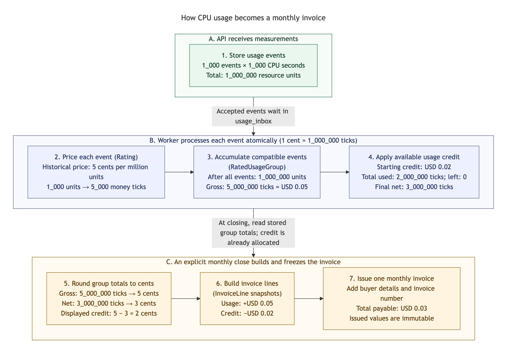

# From usage to invoice: ticks, rating, credit, and the database model

## Summary

This guide follows metered usage from receipt to an immutable monthly invoice,
connecting financial calculations, database fields, and the assignment's examples:

- [How to read the flow diagram](#how-to-read-the-flow-diagram): the three timing boundaries, what the arrows carry, and the units used in the example.
- [Implemented PostgreSQL schema (ERD)](#implemented-postgresql-schema-erd): all actual tables, columns, keys, and declared relationships through migration 007.
- [Why storing everything in cents is insufficient](#1-why-storing-everything-in-cents-is-insufficient): how rounding small measurements loses charges and how exact ticks preserve their value.
- [One example through the entire flow](#2-one-example-through-the-entire-flow): one workload across usage events, rating, groups, credit, rounding, invoice lines, and an invoice.
- [Usage events](#3-usage-events-what-was-consumed): the inbox contract, timestamp bounds, durable receipt, and retry content checks.
- [Historical rating](#4-rating-the-cost-under-the-historical-price): price versions, customer overrides, exact charges, rating links, interval boundaries, and an [example of incorrect current-price billing](#example-why-summing-all-units-and-using-the-current-price-fails).
- [Rated usage groups](#5-ratedusagegroup-the-rated-accounting-intermediate): grouping keys, stored totals, shared rounding boundaries, and frozen invoiced groups.
- [Credits](#6-credits-gross-charge-allocated-credit-and-balance): gross charges, ledger entries, balances, group allocations, [gross spend limits](#why-the-limit-uses-gross-charges), and [credit before rounding](#what-credit-before-rounding-means).
- [Rounding](#7-rounding-when-and-where-cents-are-produced): half-up boundaries, gross and net cent presentation, balancing credit lines, and the [historical cent-increment design](#historical-design-before-migration-004-book-only-each-new-cent-increment).
- [Invoice lines](#8-invoiceline-what-appears-on-a-particular-invoice): immutable usage and add-on snapshots, exact audit amounts, and traceability to source events.
- [Monthly invoices](#9-invoice-an-immutable-monthly-document): customer numbering, buyer snapshots, signed line totals, idempotent closing, and [complete assignment invoice examples](#example-complete-assignment-invoices).
- [Late usage](#10-late-usage-why-there-are-two-distinct-periods): original consumption months, later billing months, historical prices, spend limits, and closing boundaries.
- [Atomic processing](#11-what-must-stay-atomic-during-processing): the financial transaction, customer locks, rollback and retry guarantees, verification coverage, and operational extensions.

Billing answers several different questions in sequence: what the customer consumed, how much that consumption costs, how much credit covers, and what appears on a particular invoice. `RatedUsageGroup` connects measured usage to its accounting result. It retains the shared pricing meaning of many measurements and their exact financial value, so small charges survive rounding.

This document connects the explanation from the "Calculating in ticks" discussion to the project's database model. It follows one small example through the entire flow, then explains price changes, credit allocation, rounding, late usage, and the assignment's invoices.

## How to read the flow diagram

The diagram answers one question: **how do many small CPU measurements become the amount payable on one monthly invoice?** Follow the phases from top to bottom and the numbered boxes inside each phase from left to right.

| Phase and color | When it happens | What it produces |
| --- | --- | --- |
| A, green: receipt | The API accepts measurements from the platform. | Durable raw usage events waiting in `usage_inbox`. |
| B, blue: accounting | The worker processes each accepted event. | Historical pricing, growing exact group totals, and credit allocations. Steps 2–4 commit together for each event. |
| C, amber: issuance | An operator explicitly closes the customer's billing month. | Cent-valued lines, an invoice number and buyer snapshot, and an immutable issued invoice. |

The example uses **one customer, one CPU metric, one historical price, and one open October 2026 billing period**. The platform sends 1_000 events of 1_000 CPU seconds each. At 5 cents per million resource units, their combined gross cost is USD 0.05. An illustrative starting credit of USD 0.02 covers part of that cost, leaving USD 0.03 payable. All events are processed before closing; there are no add-ons or later credit grants. The price comes from the assignment; the 2-cent credit is an example input, separate from the complete assignment invoices in [section 9](#example-complete-assignment-invoices).



[Open full-size PNG](../diagrams/usage-to-invoice/usage-to-invoice.png) · [Editable Mermaid source](../diagrams/usage-to-invoice/usage-to-invoice.mmd).

Three different quantities appear in the boxes:

- **Resource units** measure consumption: in this example, one unit is one CPU second.
- **Ticks** measure exact money: 1 cent is 1_000_000 ticks. One 1_000-unit event costs 5_000 ticks, so even its fraction of a cent is preserved.
- **Cents** are the invoice's display unit: the group totals become usage of +5 cents and credit of −2 cents, totaling 3 cents.

Steps 3 and 4 show the cumulative state **after all 1_000 events**, while step 2 shows the price of **one event**. The worker updates the group and applies available credit as each event is processed. It does not wait for all events to arrive before allocating credit. It also maintains `booked_charge_cents`, a running rounded gross projection; exact credit allocation continues to use ticks. Step 5 shows the final gross/net rounding used to construct the invoice's lines.

`Rating` means assigning the historical price and calculating the exact charge. `RatedUsageGroup` is the shared running total for compatible events: the same customer, price version, original usage month, and billing month. `InvoiceLine` is a frozen item on the issued document. An invoice can include several groups, so the single-group example is only the smallest complete path. Add-on purchases supply additional lines through a separate path and cannot consume usage credit.

The phase boxes distinguish receipt, accounting, and issuance. The seven numbered steps describe accounting transformations; they do not each require their own service or table. `InvoiceLine` values are stored together in `invoices.snapshot.lines`. The next section shows the actual tables and relationships.

The schema below builds on [inbox migration 001](../../migrations/001_usage_inbox.sql) and [accounting migration 002](../../migrations/002_billing_model.sql), introduced in [PR #8](https://github.com/pupitooo/e2b-billing-api/pull/8). [Migration 003](../../migrations/003_assignment_seed.sql) contains the initial catalog. Migration 004 converts credit to exact ticks. Shared Go calculations are implemented in `internal/accounting`; the worker persists them transactionally through `internal/billing`. Migrations 005–007 add closures, operation history, durable cohorts, invoice snapshots, and frozen-group links. The [financial rules](accounting-rules.md) describe the current contract.

The flow diagram follows the required `Credits → Rounding` order. On 9 October 2026 the user confirmed credit allocation in ticks before rounding. [Migration 004](../../migrations/004_exact_credit.sql) therefore converts balances, allocations, and the ledger to exact ticks. The earlier cent-based design is retained below as a historical alternative; the current policy uses exact ticks.

## Implemented PostgreSQL schema (ERD)

This ERD shows all **18 actual tables** after migrations `001` through `007`, including the migration runner's `schema_migrations` table. It uses the SQL table and column names, types, primary keys, foreign keys, and database cardinalities. The schema was checked against the migrations on **10 October 2026**.


[Open full-size PNG](../diagrams/implemented-data-model/implemented-data-model.png) · [Editable Mermaid source](../diagrams/implemented-data-model/implemented-data-model.mmd).

`PK` and `FK` mark column membership in primary and foreign keys; labels in parentheses identify composite foreign keys. Solid relationships include the referenced identity in the child's primary key; dashed relationships are other declared foreign keys. All columns are `NOT NULL` unless labeled `Nullable`. `billing_ticks` and `billing_signed_ticks` are exact integer-valued `numeric` domains; their money rules are explained below.

The stored path from a measurement to its invoice is `usage_inbox → usage_ratings → rated_usage_groups → invoiced_usage_groups → invoices`. `price_versions` supplies the historical price, `credit_entries` records grants and usage debits, and `monthly_usage` retains gross spend in the original usage month. `customer_billing_state` holds the current credit balance, spend limit, state version, and next invoice number.

`invoice_closings` identifies a customer/month closing attempt; `invoice_closing_receipts` fixes its cohort by linking to actual inbox identities. `invoices` references `closed_billing_months` by `(customer_id, billing_month)`, while `invoiced_usage_groups` links each frozen group to its issued invoice. The optional cardinality allows a closed month without an invoice at the SQL level; the application publishes closure, invoice, group links, and numbering in one transaction.

**Invoice lines are stored in `invoices.snapshot.lines`, not a separate SQL table.** The JSON snapshot also preserves buyer details, exact audit amounts, and issue time. Add-on lines use the purchased price stored in `addon_subscriptions`; the ERD shows that table's catalog and customer foreign keys, while invoice traceability to a subscription is stored in the JSON snapshot.

`usage_inbox.customer_id` and `usage_inbox.metric` are input text without catalog foreign keys. Every drawn relationship corresponds to a declared SQL foreign key; receipt matching, price ownership, frozen-group protection, and the closing transaction add the integrity rules described in the [billing model guide](billing-model.md#tables-and-relationships). `schema_migrations` has no financial relationships.

## 1. Why storing everything in cents is insufficient

Consider the assignment's price: **USD 0.05 per 1_000_000 units** of `cpu_seconds`. In this example one CPU second is one resource unit. The price per million is therefore 5 cents.

The platform sends 1_000 separate events, each containing 1_000 units:

```text
1_000 events × 1_000 units = 1_000_000 units
```

One measurement costs:

```text
1_000_000 units -> 5 cents
    1_000 units -> 0.005 cent -> USD 0.000_05
```

Rounding each measurement immediately to whole cents produces zero. Multiplying zero by 1_000 still produces zero, although a million units should cost 5 cents. The result would depend on whether the platform sent one measurement or 1_000 smaller ones.

We therefore use a smaller exact unit of money:

```text
1 cent = 1_000_000 ticks
1 USD  = 100_000_000 ticks
1 tick = USD 0.000_000_01
```

A small event retains its value:

```text
1_000 units -> 0.005 cent -> 5_000 ticks
```

The group adds the exact values:

```text
event #1          5_000 ticks
event #2          5_000 ticks
...
event #1_000      5_000 ticks
----------------------------
total         5_000_000 ticks
              = 5 cents
              = USD 0.05
```

This resembles adding small lengths in millimeters and displaying the result in meters. Rounding every small segment to whole meters first would lose part of the actual length.

**Keep each measurement's exact value and round the cumulative total of its group.** Ticks prevent premature loss of precision; the rounding rule is a separate decision.

## 2. One example through the entire flow

This is the diagram's example, now mapped to the implementation. The example customer consumes 1_000_000 units before 15 October 2026, delivered as 1_000 events of 1_000 units. A USD 0.02 credit grant is already available before processing begins. Every event belongs to the same group; there is no add-on.

| Step | Input → output in this example | Stored result or calculation |
| --- | --- | --- |
| 1. Usage events | 1_000 measurements × 1_000 CPU seconds → 1_000_000 resource units, retaining each event's identity and interval. | 1_000 `usage_inbox` rows, each with `units = 1_000`. |
| 2. Rating | One event's 1_000 units + the historical price of 5 cents per million → 5_000 exact money ticks. | `price_versions` supplies the rate; `accounting.Rate` calculates the charge. `usage_ratings` links each event to its group. |
| 3. RatedUsageGroup | 1_000 rated events → one group with 1_000_000 units and 5_000_000 gross ticks (USD 0.05). | `rated_usage_groups.total_units = 1_000_000`, `exact_charge_ticks = 5_000_000`. |
| 4. Credits | Starting credit of 2_000_000 ticks pays for the first 400 events → total credit used of 2_000_000 ticks, zero credit left, and 3_000_000 net ticks. | `allocated_credit_ticks = 2_000_000`; `credit_entries` retains individual debits; `customer_billing_state.credit_balance_ticks = 0`. Gross ticks remain 5_000_000. |
| 5. Rounding | Gross 5_000_000 ticks → 5 cents; net 3_000_000 ticks → 3 cents; their difference → 2 cents of displayed credit. | `accounting.InvoiceAmounts` calculates the final presentation. The worker's running gross projection is `booked_charge_cents = 5`. |
| 6. InvoiceLine | The calculated cents → one usage line of +5 cents and one credit line of −2 cents. | Ordered `invoices.snapshot.lines`; `invoiced_usage_groups` links the invoice to its frozen group. |
| 7. Invoice | Signed lines of +5 and −2 cents + buyer details and a reserved number → an immutable October invoice totaling 3 cents (USD 0.03). | One `invoices` row per customer/billing month, with `total_cents = 3` and the complete snapshot. |

Each event costs 5_000 ticks. The first 400 events consume the initial `400 × 5_000 = 2_000_000` ticks of credit; the remaining 600 events add `600 × 5_000 = 3_000_000` payable ticks. Closing snapshots that result without debiting credit again. With zero starting credit, the same events would produce +5 cents of usage, a zero credit line, and a USD 0.05 invoice.

Invoice calculation can work with a few already rated groups instead of loading and pricing every small event again. Individual events remain traceable through their rating links, so aggregation preserves the origin of the charge.

## 3. Usage events: what was consumed

An event might say: "Cyberdyne's sandbox consumed 1_000 `cpu_seconds` during this interval." It is an increment to count exactly once. A repeatedly reported lifetime counter would require a different contract.

In the database this is one `usage_inbox` row:

| Columns | Meaning |
| --- | --- |
| `source`, `event_id` | The measurement's composite primary key; retries and changes in batching use the same identity. |
| `schema_version` | A positive event-contract version, supplied explicitly. |
| `customer_id`, `sandbox_id`, `metric` | Who consumed which resource and in which sandbox. |
| `period_start`, `period_end` | The consumption interval in `timestamptz`; the end must follow the start. Rating uses `[start, end)`. |
| `units` | A non-negative integer `bigint` containing the resource quantity. |
| `received_at` | The server-supplied receipt time. Historical pricing uses consumption time. |
| `processed_at`, `processing_error` | Accounting processing state. Successful completion cannot coexist with an unresolved error. |

The application supports UTC calendar years **1000 through 9999**, including the minimum instant `1000-01-01T00:00:00Z`. Validate these bounds after converting the supplied offset to UTC. For example, `1000-01-01T00:00:00+01:00` falls in UTC year 0999 and is rejected, while `0999-12-31T23:30:00-01:00` falls in UTC year 1000 and is accepted. Calendar years and timestamps use ordinary digits without underscore separators.

The inbox has no financial columns, `group_id`, or foreign keys to customers and metrics. It can durably preserve input whose catalog records are missing; subsequent processing must record that problem visibly.

The unique identity prevents duplicate rows. Ingestion also compares content: an identical retry preserves the original values and receipt time, while different content under the same ID produces a conflict. Successful inbox receipt confirms durable storage. Credit allocation and invoice issuance occur in later stages.

The meaning of a unit belongs to the event contract. Supporting fractions of CPU seconds would require defining another integer measurement unit, for example. Ticks provide a finer unit of **money**; fractional resource units need their own representation.

## 4. Rating: the cost under the historical price

The pure Go calculation `accounting.Rate` performs rating; the worker commits its result with every financial projection and inbox completion. This schema has no separate `rating` table that calculates prices. The worker selects the price effective at consumption time and computes the exact gross charge.

`price_versions` stores `price_version_id`, optional `customer_id`, `metric`, `price_per_million_cents`, and `effective_from`. `customer_id IS NULL` denotes a default price. The latest eligible customer-specific price takes precedence over the latest eligible default. Versions are append-only, so price changes preserve historical prices.

For the current price contract:

```text
price_unit_count = 1_000_000
ticks_per_cent = 1_000_000
exact_charge_ticks = (((units × price_per_million_cents) × ticks_per_cent) / price_unit_count)
```

The constants `accounting.PriceUnitCount` and `accounting.TicksPerCent` describe resource units per price and ticks per cent, respectively. Their current values cancel. At 5 cents per million, the result is `(((1_000 × 5) × 1_000_000) / 1_000_000) = 5_000 ticks`. The calculation multiplies before dividing and rejects a fractional-tick result.

The tick column uses the `billing_ticks` domain over exact PostgreSQL `numeric`. It accepts only non-negative finite integers. Aggregated `total_units` also uses integer-valued `numeric`, allowing totals beyond the `bigint` range of one event. Go must use checked integer arithmetic or arbitrary-precision integers. Overflow must fail visibly. These exact financial calculations do not use `float64`.

Both default and customer-specific rates support only whole cents **per million units** in this model. This still allows individual measurements to cost far less than a cent. [Issue #29](https://github.com/pupitooo/e2b-billing-api/issues/29) proposes a per-version `price_unit_count` with 1_000_000 for all existing prices. A variable denominator would still require exact whole-tick charges: merely requiring a multiple of a million is insufficient, since 5 cents per 2_000_000 units gives 2.5 ticks for one unit. The proposal preserves the current money resolution; prices requiring fractional ticks would need a separate precision change.

### Example: why summing all units and using the current price fails

Use the assignment's actual price changes: 5 and 6 cents per million. The earlier discussion also used an illustrative price of 8 cents, which is outside the seed catalog.

| Cyberdyne consumption | Historical price | Exact result |
| --- | --- | --- |
| 1_000_000 units on 10 October | 5 cents per million | 5_000_000 ticks = 5 cents |
| 1_000_000 units on 20 October | 6 cents per million, effective from 15 October | 6_000_000 ticks = 6 cents |
| Total | Two different price versions | 11_000_000 ticks = 11 cents |

Pricing both million units at the later 6-cent rate would produce 12 cents. Using the earlier 5-cent rate would produce 10 cents. A monthly total of units alone does not identify which rate applies to each part.

Acme has its own 4-cent price throughout the example period. The default change to 6 cents does not replace that eligible customer price. A late October event also uses its historical consumption price, even if it is received in November.

All versions require a finite, non-null `effective_from`. The seed supplies the
assignment's dated prices; an additional metric must have its applicable price
configured before its first measurement. There is no undated baseline. If no
price covers the original consumption time, the receipt retains
`P0 missing_valid_price: ...` and has no financial effect. Accounting reports the
P0 incident after committing that error. An operator appends the correct dated
price and explicitly releases the investigated receipt before another attempt.
See the [catalog provisioning and recovery contract](accounting-rules.md#catalog-provisioning-and-p0-recovery).

A successful assignment is recorded in `usage_ratings(source, event_id, group_id)`. Its primary key lets one inbox identity contribute to one group exactly once. Foreign keys require both the event and group. The selected price is traceable through `rated_usage_groups.price_version_id`; the rating link does not store a separate amount for each event.

Each rating segment must fit within one UTC month and one applicable price version. The link trigger checks the customer, metric, and month boundaries; it neither selects the price nor checks for a price change inside the interval. The initial rater rejects unsupported crossing segments as visible processing errors. Splitting one receipt across several price groups would require extending the current one-event-to-one-group relationship and defining how to divide units precisely.

## 5. RatedUsageGroup: the rated accounting intermediate

`RatedUsageGroup` answers: **"How much does this compatible consumption cost under one historical price?"** It contains both usage and its financial result. The group lets many measurements from different sandboxes share one rounding boundary.

The SQL table is `rated_usage_groups`. Its unique key is:

```text
(customer_id, price_version_id, usage_month, billing_month)
```

`metric` is also stored and must match the price version. All amounts are USD, so the key has no currency dimension. A different customer, price, original month, or billing month creates a different group. Sandbox is outside this key.

| Column | What it stores |
| --- | --- |
| `group_id` | The stable group identity used by rating links and credit debits. |
| `customer_id`, `price_version_id`, `metric` | The owner and pricing meaning of the group. |
| `usage_month` | The first day of the original consumption month, derived in UTC. |
| `billing_month` | The first day of the invoice period that includes the charge; it cannot precede the original month. |
| `total_units` | The exact sum of counted units. |
| `exact_charge_ticks` | The exact **gross charge before credit**. |
| `booked_charge_cents` | The cumulatively rounded gross projection; exact credit allocation uses ticks. |
| `allocated_credit_ticks` | The exact credit allocated to this group for its future invoice; at most `exact_charge_ticks`. |

The discussion used the conceptual name `gross_charge_ticks` for a group's gross charge. **The actual group column is `exact_charge_ticks`.** The name `gross_charge_ticks` belongs to another table, `monthly_usage`, which sums the gross charges of all groups for a customer's original month.

After the diagram's 1_000 small measurements, the worker accumulates:

```text
customer_id             example-customer
metric                  cpu_seconds
price_version_id        cpu-default-2026-10-01
usage_month             2026-10-01
billing_month           2026-10-01
total_units             1_000_000
exact_charge_ticks      5_000_000
booked_charge_cents     5
allocated_credit_ticks  2_000_000
```

`price_version_id` refers to the seeded default version. The example customer's starting credit is illustrative. The cent value is a rounded gross projection; the migration itself does not calculate it. The group's net charge is `5_000_000 − 2_000_000 = 3_000_000` ticks; the gross charge retains the full consumption value.

Grouping also enforces a correctness rule: adding sandbox or batch to the key would give each one its own rounding boundary, potentially changing the charge for the same total units. Omitting price or months would combine consumption with different accounting meanings.

A group's identity cannot change; running totals can increase before issuance. Migration 007 freezes invoiced groups against updates and deletes. Database constraints do not automatically prove that units equal linked event sums, ticks match selected prices, or cents follow rounding. The transactional worker maintains these relationships, which integration tests verify.

## 6. Credits: gross charge, allocated credit, and balance

The gross charge describes the value of consumption. Credit determines how much of that charge is covered by the customer's available funds.

```text
gross usage charge       USD 10.00 = 1_000 cents = 1_000_000_000 ticks
applied credit          -USD  7.00 =  -700 cents =  -700_000_000 ticks
----------------------------------------------------------------------
payable usage            USD  3.00 =   300 cents =   300_000_000 ticks
```

`exact_charge_ticks` remains 1_000_000_000. Replacing it with 300_000_000 would lose the original consumption value. Credit also preserves `total_units` and the historical price.

The current schema represents credit in three places:

| Location | Question answered |
| --- | --- |
| `credit_entries` | Which grant or debit changed the account, and why? |
| `customer_billing_state.credit_balance_ticks` | How much exact credit is available now? |
| `rated_usage_groups.allocated_credit_ticks` | How much exact credit must this group retain for its future invoice? |

The ledger contains `credit_entry_id`, `customer_id`, a stable `operation_id`, optional `group_id`, a signed `amount_ticks`, and `recorded_at`. A grant is positive and has no group; a debit is negative and links to a group owned by the same customer. Zero debits are omitted. Records are append-only, and `(customer_id, operation_id)` is unique so retrying one operation cannot grant or consume credit twice.

The balance is a fast ledger projection. Before allocating credit, the worker locks the `customer_billing_state` row and changes the balance, ledger, group allocation, and `state_version` together. The database does not calculate the ledger sum or verify agreement between these projections automatically.

### Why the limit uses gross charges

The example above counts USD 10 toward the monthly limit even though the customer pays only USD 3 for usage. `monthly_usage.gross_charge_ticks` retains the charge in the **original UTC consumption month**, before credit and excluding add-ons.

Convert `customer_billing_state.spend_limit_cents` to the same precision. For a configured limit:

```text
reached = (gross_charge_ticks >= (spend_limit_cents × 1_000_000))
```

A USD 8 limit is therefore reached at USD 10 of gross consumption, even when payable usage is only USD 3. An unset limit (`NULL`) means unlimited; a zero limit is reached even with zero usage. Billing continues to accept and account for all measured consumption. Credit pays for usage only; it cannot cover the USD 20 monthly `concurrency_pack`.

### What credit before rounding means

A whole cent of credit converts exactly to ticks. Exact usage can consume less than a cent of that credit:

```text
available credit = 1 cent = 1_000_000 ticks
gross usage = 5_000 ticks
applied credit = min(1_000_000, 5_000) = 5_000 ticks
remaining credit = 995_000 ticks = 0.995 cent
net usage = 0 ticks
```

Before migration 004, `credit_balance_cents`, `credit_entries.amount_cents`, and `allocated_credit_cents` were `bigint` columns. They could represent neither this debit nor the remaining 0.995 cent. A 5_000-tick debit is only a fraction of a cent.

Migration 004 introduces non-negative `credit_balance_ticks` and `allocated_credit_ticks`, plus signed integer `credit_entries.amount_ticks`. It multiplies the original cents by a million and preserves history; incompatible legacy allocations exceeding exact gross charges are rejected atomically. `accounting.AllocateCredit` allocates exact credit to newly processed usage. Allocations follow transaction order under the customer lock; a later grant does not rewrite earlier allocations. Fractional-cent credit remains in the account as ticks.

The historical alternative compatible with the columns before migration 004 instead allocates credit against new cumulative **cent increments** of a group. It preserves exact usage ticks, but operationally computes gross cents first and then allocates cent credit. These are distinct policies. The confirmed current policy allocates exact ticks before rounding; the historical cent alternative below explains the difference.

## 7. Rounding: when and where cents are produced

Rounding applies to the cumulative amount of a compatible group. Raw units and exact ticks retain their values. The rounding rule is a design choice: the assignment requires cent-valued invoices and the example's results, but leaves some boundary cases unspecified.

The shared `RoundCents` calculation uses `half-up` for non-negative amounts, rounding half a cent upward:

```text
round_half_up_cents(ticks) = floor((ticks + 500_000) / 1_000_000)
```

| Exact amount | Result |
| --- | --- |
| 5_000 ticks = 0.005 cent | 0 cents |
| 499_999 ticks = 0.499_999 cent | 0 cents |
| 500_000 ticks = 0.5 cent | 1 cent |
| 1_000_000 ticks = 1 cent | 1 cent |
| 617_283_945 ticks = 617.283_945 cents | 617 cents = USD 6.17 |

The current `InvoiceAmounts` rounds the group's cumulative gross and net amounts. The credit line is the negative difference between those cent values, rather than an independently rounded exact debit. Line totals therefore equal rounded net usage. With 1 cent gross and exactly 0.5 cent of credit, net usage of 0.5 cent rounds to 1 cent; displayed credit is 0 cents, while the ledger retains an exact 500_000-tick debit. The issued invoice snapshot retains those exact amounts for audit.

### Historical design before migration 004: book only each new cent increment

This section retains the original cent alternative and its column names at that time. The assignment allows credit balances to be queried before invoice issuance. After every event, the earlier design therefore calculates the rounded **total group state**, subtracts previously booked cents, and allocates credit only against the difference:

```text
new_booked_cents = round_half_up_cents(new_exact_charge_ticks)
delta_cents = new_booked_cents - old_booked_charge_cents
credit_debit_cents = min(credit_balance_cents, delta_cents)

booked_charge_cents = new_booked_cents
allocated_credit_cents += credit_debit_cents
credit_balance_cents -= credit_debit_cents
credit_entries.amount_cents = -credit_debit_cents  // only when positive
```

The group grows as follows with 1_000-unit measurements at 5 cents per million:

| Event count | `total_units` | `exact_charge_ticks` | Cumulative `booked_charge_cents` |
| --- | --- | --- | --- |
| 1 | 1_000 | 5_000 | 0 |
| 100 | 100_000 | 500_000 | 1 |
| 200 | 200_000 | 1_000_000 | 1 |
| 1_000 | 1_000_000 | 5_000_000 | 5 |

Exact values remain available when the running cent projection changes. Between the 100th and 200th events, one cent has already been booked, so it is not added again. All cent increments sum to the rounded result for the entire group.

This preserves the same gross charge under different splits of **the same open group**. It does not prove that credit allocations are independent of the order of different groups, late input, or new grants. The earlier design uses credit available at processing time and does not retroactively change historical allocations when later grants arrive; that policy requires explicit worker tests.

The invoice then snapshots already booked gross cents and allocated credit. Closing does not allocate credit again or round individual events again. Operationally, this historical alternative converts gross charges to cents before allocating credit. The diagram's exact-credit-before-rounding flow and the historical cent columns must be read with that distinction in mind.

## 8. InvoiceLine: what appears on a particular invoice

`RatedUsageGroup` retains the rated accounting intermediate. `InvoiceLine` preserves what appeared on a specific issued invoice. A group can grow during an open period; an issued line must retain its values when later measurements, prices, or addresses change.

The logical ERD proposed separate relational invoice lines. The implementation stores
ordered lines inside immutable `invoices.snapshot`, with `invoiced_usage_groups` linking
back to frozen accounting groups. Each usage line snapshots metric, original month,
price version, units, exact gross/credit ticks, description, and signed cent presentation.
Add-on lines retain subscription identity and purchased whole-cent price. The snapshot
and group freeze commit together; later group, catalog, or address changes cannot alter
an issued document. The public schema is in [OpenAPI](../api/openapi.yaml).

The current policy derives usage and credit lines with `InvoiceAmounts(exact_charge_ticks, allocated_credit_ticks)`. Credit can be presented as a combined line by summing already calculated cent differences, but its origin and exact ticks must remain traceable. Combining lines cannot introduce another rounding step.

Add-on charges reach the invoice through a separate path: `addon_subscriptions.monthly_price_cents` retains the purchase price. It requires neither resource rating nor usage credit and is already in whole cents. An invoice can therefore contain lines that did not originate as usage events.

The intended usage audit path is:

```text
invoice line -> frozen rated group -> usage_ratings -> usage_inbox
                                 -> price_versions
                                 -> credit_entries
```

## 9. Invoice: an immutable monthly document

**A whole UTC calendar month is the fixed billing period.** The generation and
delivery dates never shift its boundaries. For example, a January invoice created
on 20 February still has the January calendar period; later input follows the
late-usage rule. See the [fixed contract](accounting-rules.md#fixed-calendar-month-contract)
and the [generation versus delivery proposals](accounting-rules.md#invoice-generation-and-delivery-proposal).

The `invoices` table stores customer, billing month, number, total cents, and the full
immutable buyer/financial JSON snapshot. Its primary key permits one invoice per
`(customer_id, billing_month)` and its unique constraint protects per-customer numbers.
`customer_billing_state.next_invoice_number` starts at one and advances atomically
under the account lock. Numbering is per customer: `ACME-0001`, `ACME-0002`;
Cyberdyne's sequence is independent. Retrying a close returns the original snapshot.

`total_cents` is the exact integer sum of signed lines. The address comes from `customers` at issuance and is stored in a snapshot. Later customer changes must preserve the issued document.

### Example: complete assignment invoices

Pure Go, database, and [public API simulator tests](../simulator/billing-scenarios.md) verify these literal results:

| Line | ACME-0001, October | ACME-0002, November | CYBERDYNE-0001, October |
| --- | --- | --- | --- |
| Acme usage, 4 cents/million | USD 12.00 | USD 4.00 | — |
| Late October Acme usage, 4 cents/million | — | USD 2.00 | — |
| Usage at 5 cents/million | — | — | USD 6.17 |
| Usage at 6 cents/million | — | — | USD 12.00 |
| `concurrency_pack` | USD 20.00 | USD 20.00 | — |
| Allocated credit | −USD 12.00 | −USD 6.00 | USD 0.00 |
| **Total** | **USD 20.00** | **USD 20.00** | **USD 18.17** |

Acme receives a USD 25 grant (`amount_ticks = 2_500_000_000`). October's 300 million units at 4 cents per million produce `1_200_000_000 ticks`, or 1_200 cents. Allocating USD 12 of credit leaves USD 13. The invoice contains usage of `1_200`, credit of `-1_200`, and an add-on of `2_000`, totaling `2_000` cents.

November's invoice includes USD 2 of late October usage and USD 4 of November usage. Their groups have separate original months; together they consume USD 6 of credit. The balance falls from USD 13 to USD 7. The add-on contributes another USD 20 and cannot consume credit. The invoice again totals USD 20. Issuance and retries must not deduct credit a second time.

Cyberdyne's first rate gives `123_456_789 × 5 = 617_283_945 ticks`, rounded to 617 cents. The second rate creates another group with `200_000_000 × 6 = 1_200_000_000 ticks`, or 1_200 cents. The invoice totals 1_817 cents. Exact gross October usage is `1_817_283_945 ticks`, above the USD 15 limit (`1_500_000_000 ticks`). November's limit is evaluated against November's gross state; October's invoice retains its issued values.

## 10. Late usage: why there are two distinct periods

Acme consumes 50 million units on 30 October, but the platform delivers them after October's invoice has been issued. Rating still uses October's customer-specific price of 4 cents per million:

```text
50_000_000 × 4 = 200_000_000 ticks = USD 2.00
```

The new group has:

```text
usage_month    2026-10-01
billing_month  2026-11-01
```

November's 100 million units form another group:

```text
usage_month    2026-11-01
billing_month  2026-11-01
exact_charge_ticks  400_000_000
```

November's invoice includes USD 2 for October and USD 4 for November, while the gross projection for limits assigns the USD 2 back to October. After the late charge, Acme's gross usage is USD 14 for October and USD 4 for November. The issued October invoice remains immutable.

A single "month" column would lose this distinction. A rated group describes the origin and cost of usage; an invoice line describes the particular issued document that bills it.

The implemented `CloseMonth` captures a stable cohort of accepted customer events. It drains their processing without holding the customer lock across those transactions, then atomically freezes groups and creates the invoice snapshot under that lock. An unresolved error in the cohort blocks closing. `routingMonths` treats a closing month as unavailable to receipts outside that cohort, so later input reaches an appropriate open period. Closing and routing are implemented in `internal/billing`.

## 11. What must stay atomic during processing

In one transaction, the worker must assign the event, update the group and original-month gross state, apply any credit debit and balance change, update `state_version`, and mark inbox `processed_at`. Otherwise a crash could consume credit without completing the event, or a retry could apply the financial effect twice.

Unique `usage_ratings` links are a necessary safeguard, but do not alone prove exactly-once financial effects. Writes must share a transaction and customer lock. On error, input remains traceable; missing customers, metrics, or prices must fail visibly rather than create free consumption.

The confirmed policy allocates sub-cent ticks before rounding. Pure Go tests verify the amounts above, half-cent boundaries, split usage, price and UTC boundaries, later grants, late routing, and overflow. Integration tests verify atomic rollback on a late write failure, concurrent workers and closing, immutable snapshots, idempotent numbering, and agreement between line sums and totals. Public simulator workflows verify unavailable HTTP endpoints and restart after a lost committed response. Operators invoke monthly closing explicitly in increasing month order; an automatic scheduler and high-volume historical-price validation remain extensions.
