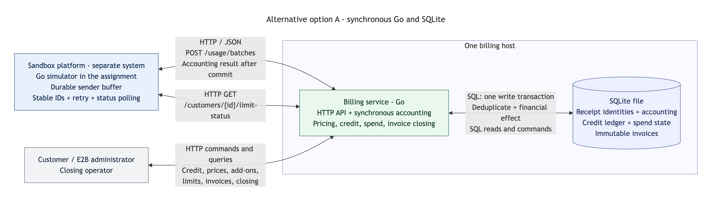
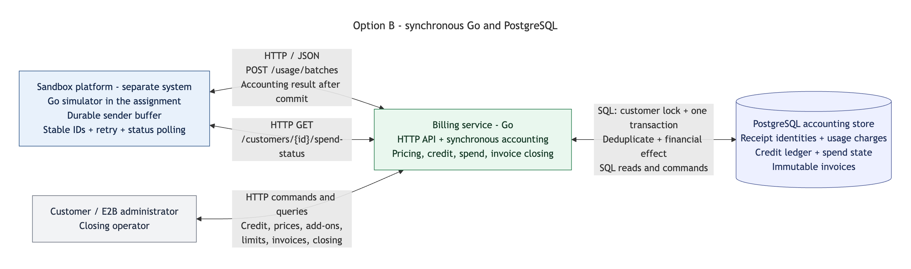
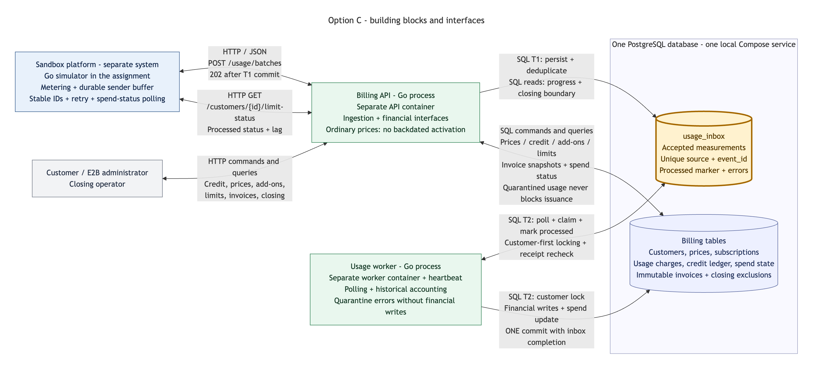
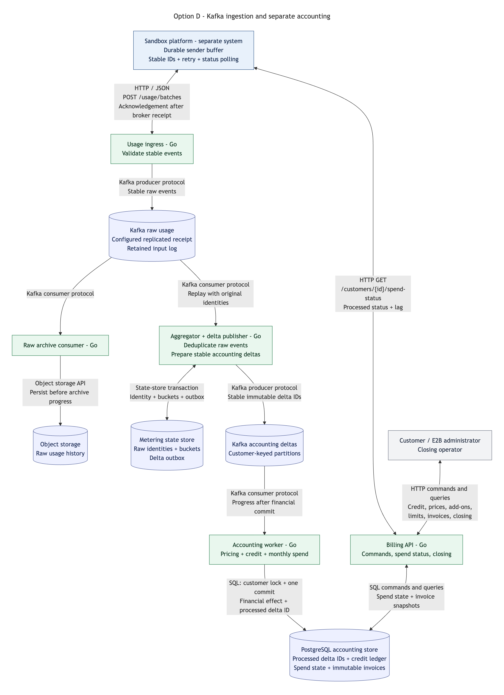

# Billing architecture options

Option C is the selected starting architecture. The implementation provides PostgreSQL, `usage_inbox`, an HTTP API response skeleton, and a standalone Go worker runtime. Durable HTTP ingestion, accounting, financial tables, and the platform simulator remain planned. This document records the alternatives considered and the basic rationale. TODO sections reserve the analysis needed before claiming support for higher load.

Go is fixed for every option. Storage, transport, and processing arrangements vary. These are assignment design proposals, not descriptions of E2B's production infrastructure. Payment processing, tax calculation, and authentication are outside the assignment.

## Options at a glance

| Option | Storage and processing | Usage acknowledgement | Main tradeoff |
| --- | --- | --- | --- |
| A | Go API, synchronous accounting, SQLite | After the financial transaction commits | Minimal setup; database writes share one writer. |
| B | Go API, synchronous accounting, PostgreSQL | After the financial transaction commits | One accounting path; ingestion waits for financial work. |
| C — selected | Go API, PostgreSQL inbox, asynchronous Go worker | After the inbox transaction commits | Recoverable pending work; accounting and spend status can lag. |
| D | Go ingress, Kafka, aggregation, PostgreSQL accounting | After the configured durable broker acknowledgement | Separate ingestion and processing; more services and recovery boundaries. |

Every option requires stable `(source, event_id)` identities, durable sender storage outside the sandbox lifecycle, and retries until the matching acknowledgement. The [system contracts](../../README.md#system-contracts) record the required identities, delivery guarantees, and processing boundaries. Storage must preserve each measurement's original consumption time.

## Option A: synchronous Go service with SQLite

The API validates, deduplicates, prices usage, allocates credit, and updates spend in one SQLite transaction before responding. SQLite stores receipt identities, accounting records, and immutable invoices on the billing host. This keeps local setup small.

**Weak point:** an Acme usage write and a Cyberdyne invoice closing compete for the same database writer. Short transactions and bounded batches reduce waiting, at the cost of more batch coordination; spreading writers over hosts requires a storage change. SQLite WAL permits only one writer at a time and requires participating processes on the same host. [SQLite WAL concurrency](https://www.sqlite.org/wal.html#concurrency).

[Native Mermaid source](../diagrams/option-a-components/option-a-components.mmd).

## Option B: synchronous Go service with PostgreSQL

The API performs ingestion and accounting in one PostgreSQL transaction. Receipt identity, usage charges, credit allocation, and spend state commit together; the response confirms that accounting has completed. Customer locks coordinate shared credit and closing while independent customers can proceed separately. [PostgreSQL row locks](https://www.postgresql.org/docs/18/explicit-locking.html#LOCKING-ROWS).

**Weak point:** a slow accounting transaction delays usage acknowledgement and spend-status updates. For example, a large Cyberdyne batch can keep its other financial operations waiting on the customer lock. Smaller batches and shorter transactions reduce that delay, but add coordination and do not remove the customer's shared-credit serialization.

[Native Mermaid source](../diagrams/option-b-components/option-b-components.mmd).

## Option C: PostgreSQL inbox and asynchronous Go worker

The planned ingestion API commits validated measurements to `usage_inbox` and then acknowledges receipt. A worker will subsequently claim pending rows and commit their financial effects with the processed marker. The API and worker run as separate Go processes and Compose services, sharing the repository and one PostgreSQL database. They can be restarted and deployed independently; production can scale their replica counts separately. The current worker only runs its lifecycle and heartbeat, with accounting disabled.

Process isolation contains a worker crash and allows separate resource limits. It does not isolate shared database contention: a future worker can still delay API writes through long transactions or exhausted database capacity. Bounded connection pools, batch sizes, query deadlines, and measured concurrency remain necessary.

**Weak point:** accepted input can be ahead of the financial state. If Cyberdyne's second example hour is waiting in the inbox, the platform can still see the earlier spend below its USD 15 limit. Exposing processing progress and bounding backlog makes this visible; invoice closing also needs a fixed boundary of accepted input. Those measures require extra state, waiting, error recovery, and a freshness agreement. The shared database remains an availability and capacity dependency for both ingestion and accounting.

[Native Mermaid source](../diagrams/option-c-components/option-c-components.mmd).

## Option D: Kafka ingestion and separate accounting pipeline

A Go ingress publishes stable raw measurements to Kafka. An archive consumer preserves raw history; an aggregator prepares immutable deltas through a durable state store and outbox; accounting workers apply those deltas to PostgreSQL. The billing API serves financial commands and status. This arrangement provides separate places to buffer and distribute work.

**Weak point:** a worker can commit Acme's credit allocation and crash before recording its Kafka progress. Replaying the input must preserve the original identity and avoid another financial effect. Stable delta IDs and atomic accounting deduplication address this, with additional state, replay tests, retention management, and operating cost. Kafka transactions alone do not make an external PostgreSQL write atomic with consumer progress. [Kafka delivery semantics](https://kafka.apache.org/43/design/design/#semantics).

[Native Mermaid source](../diagrams/option-d-components/option-d-components.mmd).

## Why option C was selected

The starting architecture uses option C and establishes the database and inbox before receipt validation and accounting. Incoming measurements must have durable storage independent of the accounting worker. Later processing preserves that boundary. Pending work remains explicit without introducing a broker in the first iteration.

C adds a second transaction and a gap between receipt and accounting. An inbox primary key prevents duplicate rows; financial correctness still requires the worker's accounting writes and completion marker to commit together. The source buffer must retain unacknowledged measurements. Choosing C does not establish a throughput limit or select D as the eventual production architecture.

## Workload assumptions for further analysis

The assignment asks the design to consider about 50_000 customers and potentially billions of monthly sandbox records. The implementation is not required to demonstrate that capacity. For these calculated examples, assume one metric, one record per active sandbox per minute, a constant average active-sandbox count, and a 30-day comparison period. Billing itself continues to use actual UTC calendar months.

| Illustrative profile | Average active sandboxes per customer | Records per second | Records per 30 days |
| --- | ---: | ---: | ---: |
| 1_000 customers | 10 | 166.7 | 432 million |
| 50_000 customers | 10 | 8_333.3 | 21.6 billion |
| 50_000 customers | 100 | 83_333.3 | 216 billion |

Calculated rate = customers × average active sandboxes × metrics ÷ 60. Monthly records = customers × average active sandboxes × metrics × 43_200. These counts are scenarios, not measured capacity; batching HTTP requests does not remove event identities or financial work.

## TODO: receipt and financial correctness

- [ ] Define supported schema versions, identifier and timestamp validation, interval splitting at price and UTC month boundaries, batch limits, response bodies, and atomic versus partial acceptance.
- [ ] Specify identical retries versus identity conflicts, event immutability, and how deduplication survives inbox cleanup and replay.
- [ ] Define worker claiming, lock order, concurrent customer writes, crash recovery, quarantine, and operator requeue. Include errors when reporting unfinished work.
- [ ] Choose exact money representation, overflow checks, rounding groups, time-based pricing, and credit allocation; prove results stay the same when measurements are split or reordered.
- [ ] Design a closing barrier coordinated with ingestion, including in-flight transactions and failed rows. A timestamp or sequence alone is not proof of commit order. Preserve late-usage handling, immutable invoices, and customer invoice numbering.
- [ ] Reproduce the assignment's invoice, credit, add-on, and limit results; test duplicate delivery, lost responses, late usage, and worker crashes at commit boundaries.

## TODO: freshness, durability, and operations

- [ ] Agree on spend-status freshness, pending-input visibility, month rollover, changed limits, polling cadence, and platform behaviour when status is unavailable. Count gross usage before credit and exclude add-ons.
- [ ] Define sender and billing failure coverage, retry age, permitted delay or loss, buffer capacity, overload responses, and ownership of recovery before and after receipt.
- [ ] Plan database backup, restoration, and any replication required by the agreed failure coverage. A surviving local volume covers a restart, not destruction of its only storage copy.
- [ ] Define metrics and alerts for arrival rate, processing rate, oldest unfinished input, quarantine, lock waits, and storage growth; add reconciliation between received units and accounting effects.

## TODO: higher load and evolution beyond C

- [ ] Measure average and peak sandbox counts, metrics, payload sizes, batching, synchronized minute bursts, and retry traffic. Estimate table, index, WAL, archive, and replica storage with explicit retention assumptions.
- [ ] Benchmark ingestion, workers, status reads, and closing together. Include large customers and backlog recovery while new usage continues; record latency targets and measured processing headroom.
- [ ] Evaluate customer-aware batching, query indexes, partitioning, vacuum, archive handoff, and retention. State each improvement's cost and the conditions under which it helps.
- [ ] Compare continued PostgreSQL use with separate raw ingestion and aggregation. Preserve price/month boundaries, stable delta identities, recovery checkpoints, and deduplication ownership when repartitioning.
- [ ] Define triggers for a broker or customer sharding from measured capacity, recovery time, freshness, and operating cost. Evaluate raw archive lag, broker retention, replay, and a closing boundary across all pipeline stages.
- [ ] Plan a reconciled transition with a clear accounting owner and rollback strategy; demonstrate that migration cannot drop usage, apply credit twice, or change issued invoices.

Technical references above were checked on 8 October 2026. Operational guarantees and capacity remain to be specified and measured in the TODOs.
