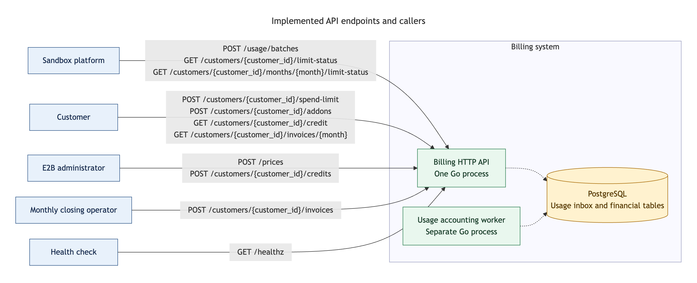

# HTTP API reference

Run `make docs` and open the printed **API reference** address, by default
[http://127.0.0.1:8082/reference/](http://127.0.0.1:8082/reference/).
Scalar provides the three-panel `modern` layout and an embedded **Test Request**
client. The [OpenAPI 3.1.2 specification](../api/openapi.yaml) defines every endpoint's
fields, examples, validation, status codes, and retry/conflict semantics.

## API endpoints and callers

[](../diagrams/api-endpoints/api-endpoints.png)

[Full-size diagram](../diagrams/api-endpoints/api-endpoints.png) ·
[Editable Mermaid source](../diagrams/api-endpoints/api-endpoints.mmd).
The same diagram appears in Scalar's introduction.

Solid arrows show HTTP requests and list every implemented method and path.
Responses return over the same connection. Caller boxes represent responsibilities,
not deployed clients or access controls; the simulator exercises platform,
customer, administrator and closing roles in its public billing scenarios.
Dashed arrows show SQL operations against the shared PostgreSQL database.
API and worker communicate through the inbox, without an HTTP call between them.

The current-month limit endpoint selects the month using the server's UTC clock;
the explicit-month variant supports fixed simulator scenarios. Both report
processed gross usage and pending/error counts. The platform decides what to
do when the limit is reached. The health endpoint checks HTTP availability
without querying storage.

## Usage requests

Send one uncompressed UTF-8 JSON document with at most 1_048_576 bytes and
1–1_000 events. Field names are case-sensitive; unknown or duplicate fields,
invalid UTF-8, and unpaired UTF-16 escapes are rejected. Integer fields require
integer tokens, without fractional or exponent notation. The schemas define
required fields, identifier limits, numeric ranges, and timestamp bounds.

A batch commits atomically. Keep `(source, event_id)` and measurement content
unchanged across retries and batch boundaries, including duplicate identities
within a batch. Timestamp offsets representing the same instant are equivalent.
Identical retries preserve receipt and accounting state; changed content returns
`409` without accepting any new events. Optional `batch_id` is not stored or used
for deduplication. `202` confirms durable receipt; accounting runs asynchronously.

After `503` or a lost response, the commit outcome may be unknown: retain the
batch and retry unchanged events with backoff, observing `Retry-After` when present.
Correct invalid requests before retrying; investigate `409` conflicts.
See the [event contract](../architecture/usage-to-invoice.md#3-usage-events-what-was-consumed),
[runtime budgets](runtime-configuration.md#api-runtime-budgets), and
[accounting recovery](accounting-recovery.md) for details.

## Price activation

`POST /prices` requires `idempotency_key` in the JSON body and `effective_from`, either a timestamp or explicit `null`.
Null activates the price at the server's current UTC time after the catalog lock
is acquired, with microsecond precision. The row is committed before the `200`
response, which contains the concrete stored timestamp. For example:

```json
{
  "idempotency_key": "manual-cpu-immediate",
  "customer_id": "cyberdyne",
  "metric": "cpu_seconds",
  "price_per_million_cents": 7,
  "effective_from": null
}
```

Retry with the same request key and `null` to retain the original activation time.
Null also reuses an existing explicitly scheduled version's time when the other
fields match. An explicit timestamp must match that stored instant on retries.
Missing timestamps and backdated new explicit timestamps return `422`.
Changed customer, metric, amount, or explicit timestamp under an existing request key
returns `409`. See the [price insertion contract](../architecture/accounting-rules.md#price-insertion-contract).

## Command retries

Retry writes with the same operation key or natural identity and all original content after `503` or a
lost response; observe `Retry-After` when present. An identical retry returns the
original result. Changed content under the same identity returns `409`.

| Command | Retry identity |
| --- | --- |
| Price version | Required JSON `idempotency_key`, scoped to `/prices` |
| Credit grant or spend limit | Customer, endpoint, and JSON `idempotency_key` |
| Add-on purchase | Required JSON `idempotency_key`, scoped to the customer and add-on endpoint |
| Invoice issuance | Customer and UTC month |

Replaying an older spend-limit command returns its original result without
replacing newer configuration; read limit status for the current configuration.
Price creation and add-on purchase bodies no longer accept `price_version_id` or
`subscription_id`; billing generates price IDs and derives new subscription IDs from
the customer and add-on name, returning resource IDs in responses. New subscription
IDs use `subscription/<customer_id>/<addon_name>`, for example
`subscription/acme/concurrency_pack`. Each component is percent-encoded separately:
`acme/ops` becomes `acme%2Fops`, while a literal `acme%2Fops` becomes
`acme%252Fops`. Inputs retain their existing 256-byte limits; generated subscription
IDs can reach 1550 ASCII bytes. Subscription responses and invoice lines use this
larger response limit. No database migration is needed because the stored ID is
unbounded `text`. Earlier IDs, operation results, and issued invoices stay unchanged.
Price, add-on, credit, and spend-limit requests require the exact JSON field
`idempotency_key`: 1 through 256 visible ASCII characters without whitespace, for
example a UUID. Values are case-sensitive. Missing, null, or invalid strings return
`422`; duplicate fields, unknown aliases, and wrong JSON types return `400`.
The former `Idempotency-Key` header does not supply or override the body key.
Credit and spend-limit requests no longer accept `operation_id` in JSON.
Prices and add-ons store normalized inputs and successful results in
`api_idempotency_operations` in the same transaction as the resource. Credit
grants retain their keys in the ledger as internal `grant/<key>` operation IDs;
spend-limit changes retain them in `spend_limit_operations.idempotency_key`. Keys remain
stored indefinitely; retries survive API restarts. Failed commands reserve no key.
Retain the key and input before sending, including across browser reloads. A new
key denotes a new operation and still must satisfy catalog or subscription uniqueness.
Previously created resources retain their IDs; migration 010 cannot infer retry
keys for earlier resource commands. Migration 011 renames the spend-limit
history column without changing keys or financial state. Existing credit and
limit commands can be replayed by supplying their former `operation_id` value as
`idempotency_key`. Use updated scenario files and a new simulator state file
when switching from a checkpoint containing the former request format.

Credit grants apply immediately; `recorded_at` is audit metadata. Each customer
can hold one subscription per add-on. A purchase with a different key for the same customer/add-on conflicts,
and a new purchase cannot start in or before an already closing or closed month.

## Browser requests and service routing

The `api-docs` Compose service serves Scalar and bundled JavaScript locally.
The `docs` service exposes both the guides and `/reference/` on one browser port.
Browser API requests go through the same-origin `/api` proxy to the API; no CORS
configuration is needed. `make api-docs` starts the same portal and prints its
reference link. Starting either target also starts PostgreSQL and the API, but
does not apply migrations.

API interface changes must update the specification in the same change. Refresh
Scalar after editing `openapi.yaml`; guides rebuild and refresh automatically.
See [documentation maintenance](documentation.md) for publication,
validation, and the one-port routing configuration.
